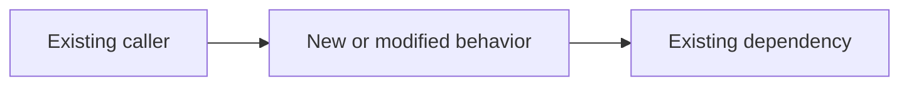

# Implementation Plan: <small vertical slice>

- **Date**: <YYYY-MM-DD>
- **Parent User Story**: <story, feature, issue, or requirement link>
- **Plan Map**: <plan map path or "Not required — single-slice requirement">
- **Source**: <requirement path or feature description>
- **Status**: Draft | Ready | In Progress | Learned | Done

## 1. Outcome & Plan Boundary

### Slice Outcome

<One observable behavior or risk-reducing capability delivered by this plan.>

### Success Evidence

- <Behavioral acceptance example.>
- <Production or learning signal.>

### In Scope

- <Capability required for this slice.>

### Out of Scope

- <Behavior deliberately excluded from this plan.>

### Candidate Follow-up Plans

- <Next vertical slice; do not decompose it into tasks yet.>

### Assumptions & Constraints

- <Assumption that permits this slice to proceed.>
- <Compatibility, security, performance, data, or operational constraint.>

## 2. Current System

### Current Flow

<Trace only the behavior relevant to this slice from entry point to downstream effect.>

### Reuse & Change Points

| Existing capability or change point | Reuse / compose / adapt / replace / create | Reason |
| --- | --- | --- |
| <file, symbol, module, contract, or new artifact> | <decision> | <semantic fit and responsibility> |

### Safety Net

- Existing behavior tests: <tests>
- Characterization gap: <behavior to protect before changing>

## 3. Design Decisions

- **Architecture Fit**: <how the slice follows existing boundaries and dependency direction>
- **Domain Model**: <concepts, rules, invariants, or small DSL vocabulary>
- **Pattern Decision**: <concrete design force, pattern adopted or rejected, and reason>
- **Key Trade-off**: <alternatives considered and why this choice is sufficient now>
- **Extension Boundary**: <credible variation supported; speculative flexibility deferred>

### Optional Architecture Diagram

Remove this subsection when a diagram would not materially improve review.

## 4. Detailed Design

Keep only concerns relevant to this slice.

- **Contract**: <API, event, UI, command, or integration behavior>
- **Data**: <schema, state, migration, consistency, or caching change>
- **Key Logic**: <critical objects, policies, functions, or concise pseudocode>
- **Failure & Resilience**: <validation, transactions, idempotency, retries, timeouts, or recovery>
- **Security & Privacy**: <authorization, validation, secrets, or sensitive data>
- **User Experience**: <loading, empty, success, error, and accessibility behavior>
- **Operations**: <ownership, logs, metrics, traces, dashboards, or alerts>

## 5. TDD & Execution Strategy

- **First Failing Behavior**: <smallest meaningful test that should fail first>
- **Real Collaborators**: <domain objects exercised directly>
- **Boundary Substitutes**: <true external boundaries replaced in tests>
- **Regression Protection**: <existing behavior protected before modification>

| Expected task boundary | Observable outcome | Test-first entry point | Main code areas |
| --- | --- | --- | --- |
| <small task candidate> | <behavior> | <first failing test> | <files or modules> |

Keep these boundaries high level. Create the executable Red–Green–Refactor checklist only after this plan is reviewed.

## 6. Delivery & Learning

- **Migration / Compatibility**: <ordering and compatibility window>
- **Rollout**: <direct release, flag, staged rollout, or canary>
- **Rollback / Containment**: <safe reversal or failure isolation>
- **Production Evidence**: <signal that confirms or challenges the plan>
- **Feedback Destination**: <requirement, follow-up plan, test, model change, or explicit non-action>

## 7. Risks & Open Questions

| Risk or question | Impact | Mitigation, experiment, or decision owner |
| --- | --- | --- |
| <item> | High / Med / Low | <next step> |

## 8. Plan Readiness

- [ ] The plan delivers one independently verifiable vertical slice.
- [ ] Important decisions are stable enough to begin; deferred decisions are explicit.
- [ ] Existing code, tests, names, and dependencies are grounded in repository evidence.
- [ ] Task boundaries can be derived without designing the entire parent User Story.
- [ ] Delivery and production learning are addressed in proportion to risk.
