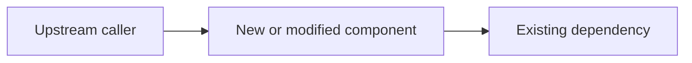

# Implementation Plan: <feature title>

- **Date**: <YYYY-MM-DD>
- **Source**: <requirement path, issue, or feature description>
- **Status**: Draft

## 1. Background & Goals

### Problem

<Business problem or user need.>

### Success Criteria

- <Observable outcome.>
- <Guardrail or operational signal.>

### Production Learning

<Evidence that will confirm or challenge the design after release.>

## 2. Scope

### In Scope

- <Capability to deliver.>

### Out of Scope

- <Explicit exclusion.>

### Assumptions & Constraints

- <Technical or business assumption.>
- <Compatibility, security, performance, data, or operational constraint.>

## 3. Current System Analysis

### Current Flow

<Trace the relevant behavior from its entry point to downstream effects.>

### Architecture & Boundaries

<Describe existing modules, services, ownership, and dependency direction.>

### Reusable Capabilities

| Existing capability | Reuse / compose / adapt / replace | Semantic fit and reason |
| --- | --- | --- |
| <file, symbol, module, or behavior> | <decision> | <reason> |

### Tests & Safety Net

- Existing behavior tests: <tests>
- Characterization gaps: <behavior to protect before changing>

### Change Points

| File, symbol, contract, or data structure | Expected change | Responsibility |
| --- | --- | --- |
| <repository-grounded path or new artifact> | <change> | <why it belongs here> |

## 4. Design Principles & Decisions

- **Architectural Consistency**: <fit with existing architecture and data flow>
- **Domain Model**: <concepts, rules, invariants, or DSL vocabulary>
- **Reuse Decisions**: <important reuse or replacement decisions>
- **Pattern Decisions**: <design force, pattern adopted or rejected, and reason>
- **Key Trade-offs**: <alternatives and justification>
- **Conventions**: <naming, placement, API, style, and dependency conventions>
- **Extension Boundaries**: <credible variations supported without speculative hooks>

## 5. Architecture Diagram

- **Upstream caller**: <responsibility>
- **New or modified component**: <responsibility>
- **Existing dependency**: <responsibility>

## 6. Detailed Design

Keep only the subsections relevant to the project.

### 6A. Backend

- **API Contract**: <method, path, schemas, validation, and errors>
- **Data Model**: <schema, indexes, constraints, and migration implications>
- **Key Logic**: <critical classes, functions, policies, or concise pseudocode>
- **Collaborations**: <object responsibilities and boundary interactions>
- **Resilience**: <transactions, idempotency, retries, timeouts, concurrency, and failures>

### 6B. Frontend

- **Component Hierarchy**: <page and component tree with data flow>
- **State Management**: <local, global, and server state>
- **Data Fetching**: <rendering, caching, and invalidation strategy>
- **User Experience**: <loading, empty, success, validation, and error states>
- **Accessibility**: <keyboard, focus, semantics, and assistive technology>

### 6C. Cross-cutting Concerns

- **Security & Privacy**: <authentication, authorization, validation, secrets, and data>
- **Observability**: <logs, metrics, traces, dashboards, and alerts>
- **Performance & Capacity**: <load, expensive paths, limits, and measurements>

## 7. Testing & Implementation Strategy

| Vertical slice | Observable behavior | First failing test | Verification |
| --- | --- | --- | --- |
| <slice> | <outcome> | <behavior test> | <checks and evidence> |

- **Test Levels**: <behavior, component, integration, contract, or end-to-end>
- **Real Collaborators**: <objects exercised directly>
- **Boundary Substitutes**: <true external boundaries replaced in tests>
- **Regression Protection**: <existing behavior protected before modification>

## 8. Migration, Rollout & Operations

- **Database**: <migration order, backfill, compatibility window, and rollback>
- **API & Events**: <versioning and producer-consumer compatibility>
- **Deployment**: <feature flag, staged rollout, canary, or other control>
- **Operational Readiness**: <ownership, runbook, alerts, containment, and recovery>
- **Feedback Loop**: <how production learning becomes a decision, task, test, or model change>

## 9. Risks & Mitigations

| Risk or unresolved question | Impact | Likelihood | Mitigation or experiment |
| --- | --- | --- | --- |
| <risk> | High / Med / Low | High / Med / Low | <strategy> |

## 10. Milestones

| Milestone | Observable outcome | Major dependencies | Verification or learning checkpoint |
| --- | --- | --- | --- |
| <phase> | <outcome> | <dependencies> | <evidence> |

Keep milestones outcome-oriented and high level. Create detailed executable work separately with the Implementation Task workflow.

